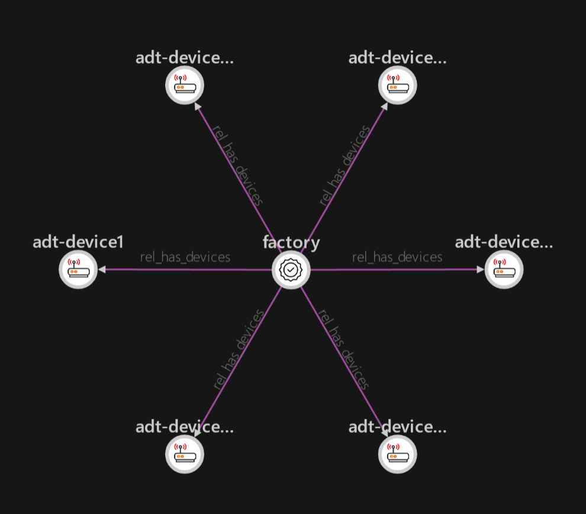
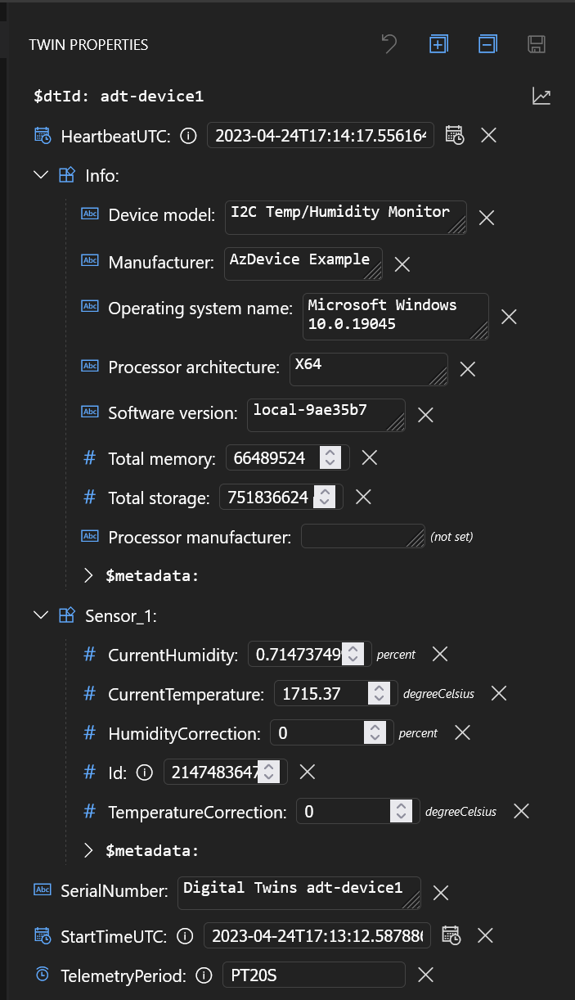

# Map IoT device data to digital twin models and relationships


This is a complete end-to-end example of how to set up an Azure Digital Twins
instance, then map telemetry and property data coming from an IoT device
via IoT Hub.

## What's Here?

* **Complete ARM Template**: Deploys an IoT Hub, DPS, Storage, Function App, and Digital Twins instance
* **Azure Function Code Example**: Maps the device telemetry and properties coming from IoT Hub into the Digital Twins instance.
* **Azure Dev Ops Pipeline Definitions**: Ready-to-use pipelines to deploy the filter from your ADO project pipeline, into the function app deployed by the ARM Template.

## Steps to Set Up (Overview)

1. Find your User Principal ID
2. Deploy Azure Resources
3. Create models, twins, and relationships
4. Send data from device client
5. Run the Azure Function locally
6. View twins in Digital Twins Explorer
7. Vizualize your environment in 3D Scenes Studio
8. Set up Continuous Deployment in Azure Pipelines  

## Find your User Principal ID

Azure Digital Twins uses [role-based access control](https://learn.microsoft.com/en-us/azure/role-based-access-control/) to gatekeep access
to an instance. Say goodbye to connection strings! This does mean if you personally want to interact directly with your twins
instance, perhaps running the CLI or viewing it in the Data Explorer, you'll need to grant access to your User Principal on your
instance.  

The deployment templates will handle setting the correct roles. You just need to find your principal ID, and provide it to the deployment. 
The [Permission Requirements](https://learn.microsoft.com/en-us/azure/digital-twins/how-to-set-up-instance-cli#prerequisites-permission-requirements)
article is a good guide to finding this principal ID. Once you have, you'll supply it to the deployment steps below.

## Deploy Azure Resources

The included [ARM Template](./deploy/azuredeploy.bicep) deploys all of the resources described in the architecture diagram above.
It also wires up the connections between services so everything is ready to go. Be sure to clone this repo with submodules, as the 
deployment template uses modules from the [AzDeploy.Bicep](https://github.com/jcoliz/AzDeploy.Bicep) project.

Here's what you do...

1. Open Powershell
3. Change to the `deploy` directory
4. Create a deployment parameters file containing your user principal ID, perhaps using the `azuredeploy.parameters.template.json` as an example.
5. Set `$env:RESOURCEGROUP` to the name of a resource group you'd like to create and deploy into.
6. Run the `BringUp.ps1` script. This creates the resource group, and starts a deployment.
7. Save the values of all `outputs` shown into evnvironment variables, perhaps in an `.env.ps1` file. For easy reference, you can start with the `.env.template.ps1` as an example for what to save.

## Create Models, Twins, and Relationships

This example sets up 6 'device' digital twins, each reporting Temperature and Humidity. These are all related to
a 'factory' digial twin, which maintains a relationship to each device.

1. Change to the `twins` directory
2. Ensure `$env:TWINSNAME` is set to the name of your Digital Twins instance
3. Run the `CreateTwins.ps1` script, which will set up models, twins, and relationships

Here's a snippet

```pwsh
$DeviceModel = "dtmi:azdevice:i2ctemphumiditymonitor;1"
az dt model create -n $env:TWINSNAME --models .\devicemodels.json
az dt model create -n $env:TWINSNAME --models .\factoryfloor.json
az dt twin create -n $env:TWINSNAME --dtmi $DeviceModel --twin-id 'adt-device1' --properties '@initialstate.json'
az dt twin create -n $env:TWINSNAME --dtmi "dtmi:com:aztwins:example_factory;1" --twin-id 'factory'
az dt twin relationship create -n $env:TWINSNAME --relationship-id has_device1 --relationship rel_has_devices --twin-id factory --target adt-device1
```

Once this is done, load up the [Azure Digital Twins Explorer](https://explorer.digitaltwins.azure.net/). Once the application is loaded, click "Run Query", which will load up a model of the twins to date.



## Send data from the device client

This example is set up work seamlessly with the [I2CTemperatureHumidityMonitor](https://github.com/jcoliz/AzDevice.IoTHubWorker/tree/main/examples/I2cTempHumidityMonitor) example client from the [AzDevice.IoTHubWorker](https://github.com/jcoliz/AzDevice.IoTHubWorker) project.
Note that this example will send simulated data by default, so there's no need to build out the whole Raspberry Pi
physical setup. However, if you DO build that out, it will work great with this example as well.

1. Clone the [AzDevice.IoTHubWorker](https://github.com/jcoliz/AzDevice.IoTHubWorker) project.
2. Ensure you have environment variables set correcly from the `Deploy Azure Resources` step above.
3. Follow the instructions there to [Create an Enrollment Group](https://github.com/jcoliz/AzDevice.IoTHubWorker/blob/main/docs/GettingStarted.md#create-an-enrollment-group).
4. Then, [Enroll a Device](https://github.com/jcoliz/AzDevice.IoTHubWorker/blob/main/docs/GettingStarted.md#enroll-a-device) named `adt-device1`. It's important that the device name match one of the digital twins created in the `Create Twins` step above.
5. Finally, [Build & Run the Device Software](https://github.com/jcoliz/AzDevice.IoTHubWorker/blob/main/docs/GettingStarted.md#buildrun-device-software), in this case, the `I2CTemperatureHumidityMonitor` example.

This will start sending data up to your IoT Hub, matching the `dtmi:azdevice:i2ctemphumiditymonitor;1` DTMI.

## Run the Azure Function locally

Azure Digital Twins rely on separate compute resources to injest data into them. Ergo, for this example, we will
use an Azure Function to injest this data. The Azure Function will listen to the Event Hub exposed by IoT Hub,
then translate those telemetry and property update messages into a form that Digital Twins can handle. 

The Azure Functions extension for Visual Studio is a great way to test out our function before deploying it.
As long as the environment is set up correctly, the locally-running function can contact both the IoT Hub
and Digital Twins instances we deployed earlier.

1. Install the [Visual Studio Extension for Azure Functions](https://marketplace.visualstudio.com/items?itemName=ms-azuretools.vscode-azurefunctions)
2. Open the `AzFn.IoTHubDigitalTwins` folder from this project in Visual Studio Code.
5. Create a `local.settings.json` file, based on the `local.settings.template.json` file.
3. Fill in the details for your deployment, using values you previously saved during the "Deploy Azure Resources" step, above. 
4. Launch the function with `F5`

Keep an eye on the logs coming up in the terminal window. You'll see the output from the function when it's triggered:

```
[2023-04-24T17:18:37.059Z] OK. EventHubToDigitalTwin function received message #3, enqueued at 4/24/2023 5:13:56 PM +00:00
[2023-04-24T17:18:37.065Z] Temperature: 1713.57
[2023-04-24T17:18:37.066Z] Humidity: 0.7139875
[2023-04-24T17:18:37.067Z] SP.user-id: System.ReadOnlyMemory<Byte>[0]
[2023-04-24T17:18:37.068Z] SP.content-type: application/json
[2023-04-24T17:18:37.069Z] SP.content-encoding: utf-8
[2023-04-24T17:18:37.069Z] SP.iothub-connection-device-id: adt-device1
[2023-04-24T17:18:37.070Z] SP.iothub-connection-auth-method: {"scope":"device","type":"sas","issuer":"iothub","acceptingIpFilterRule":null}
[2023-04-24T17:18:37.071Z] SP.iothub-connection-auth-generation-id: 1234567890
[2023-04-24T17:18:37.072Z] SP.iothub-enqueuedtime: 4/24/2023 5:13:56 PM
[2023-04-24T17:18:37.072Z] SP.iothub-message-source: Telemetry
[2023-04-24T17:18:37.073Z] SP.dt-subject: Sensor_1
[2023-04-24T17:18:37.074Z] SP.dt-dataschema: dtmi:azdevice:i2ctemphumiditymonitor;1
[2023-04-24T17:18:37.075Z] SP.x-opt-sequence-number: 3
[2023-04-24T17:18:37.076Z] SP.x-opt-offset: 3344
[2023-04-24T17:18:37.076Z] SP.x-opt-enqueued-time: 4/24/2023 5:13:56 PM +00:00
[2023-04-24T17:19:06.005Z] Sending to Digital Twin for Device:adt-device1 Patch:[{"op":"replace","path":"/Sensor_1/CurrentTemperature","value":1713.57},{"op":"replace","path":"/Sensor_1/CurrentHumidity","value":0.7139875}]
[2023-04-24T17:19:20.081Z] OK. Sent update to digital twin
```

This function does three things:
1. Prints the complete contents of the message to help us understand what's happening
2. Translates telemetry messages to corresponding twin properties.
3. Translates device twin updates containing reported properties into corresponding digital twin properties

### Print message contents

```c#
                    var body = eventData.EventBody.ToObjectFromJson<Dictionary<string, object>>();
                    foreach (var kvp in body)
                        log.LogInformation($"{kvp.Key}: {kvp.Value}");

                    foreach (var kvp in eventData.Properties)
                        log.LogInformation($"P.{kvp.Key}: {kvp.Value}");

                    foreach (var kvp in eventData.SystemProperties)
                        log.LogInformation($"SP.{kvp.Key}: {kvp.Value}");
```

### Translate telemetry messages

Digital twins only store properties, not telemetry values. Thus, my standard practice is to translate
telemetry values into a corresponding `Current{Value}` property. Of course, this requires the model
to have these properties.

```c#
    var source = eventData.SystemProperties["iothub-message-source"] as string;
    if (source == "Telemetry")
    {
        updateTwinData = new JsonPatchDocument();
        string objectpath = "/";
        if (eventData.SystemProperties.ContainsKey("dt-subject"))
            objectpath += (eventData.SystemProperties["dt-subject"] as string) + "/";

        foreach (var kvp in body)
        {
            JsonElement? el = kvp.Value as JsonElement?;
            if (el.HasValue && el.Value.ValueKind == JsonValueKind.Number)
            {
                double value = el.Value.GetDouble();
                updateTwinData.AppendReplace($"{objectpath}Current{kvp.Key}", value);
            }
        }
    }
```

### Translate reported properties directly

The device code reports the current state of all properties regularly. When IoT Hub receives this update,
it generates a device twin change event. The IoT Hub deployment in this example included a route to forward
such events to the `events` endpoint. That's what the Azure Function is listening to, so we'll get those
events in our function as well.

```yaml
    routes: [
      {
        name: 'TwinChangeEvents'
        source: 'TwinChangeEvents'
        endpointNames: [
          'events'
        ]
        isEnabled: true
      }
    ]
```

Because the device is using the same model as the digital twin, we can simply pass along all the
valid properties directly to the Digital Twin without modification.

```c#
    else if (source == "twinChangeEvents")
    {
        updateTwinData = new JsonPatchDocument();
        JsonElement? properties = body["properties"] as JsonElement?;
        JsonElement reported = properties.Value.GetProperty("reported");
        updateTwinData.Add("/",reported);
    }
```

## View twins in Digital Twins Explorer

Once there is data flowing through, you can return to the Digital Twins Explorer to view the properties
of your device. Click "Run Query" to refresh the twins, then click on "adt-device1" to see a panel of
info for this device.



## Visualize your environment in 3D Scenes Studio

Now that data is flowing, you can use [3d Scenes Studio for Azure Digital Twins](https://learn.microsoft.com/en-us/azure/digital-twins/concepts-3d-scenes-studio)
to get an overall status view of your whole system. This is is an incredibly powerful way to understand what's going on in your system quickly.
Using a 3D model of your environment, it connects a visual representation of your environment with the real-life data flowing
into your Digital Twin instance. Compared to a query view table, or even a typical text-heavy dashboard, this is a much more intuitive way to understand the data coming into your system. It also lets you spot trouble areas at a glance, while giving you the tools needed to dig in further.

Read more: [How to: Visualize an Azure Digital Twins instance in 3D](../docs/3d-scenes-studio.md)
