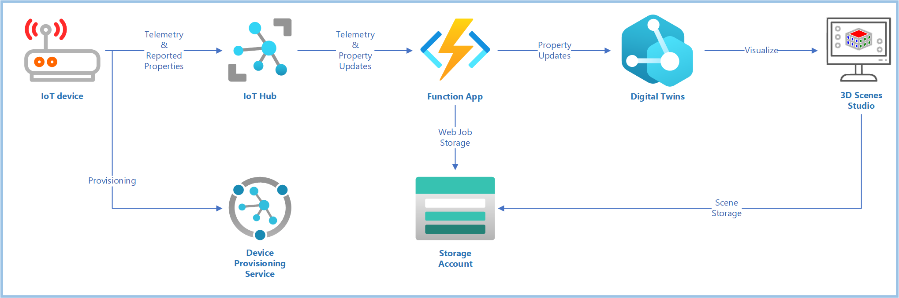

# Map IoT device data to digital twin models and relationships



This is a complete end-to-end example of how to set up an Azure Digital Twins
instance, then map telemetry and property data coming from an IoT device
via IoT Hub.

## What's Here?

* **Complete ARM Template**: Deploys an IoT Hub, DPS, Storage, Function App, and Digital Twins instance
* **Azure Function Code Example**: Maps the device telemetry and properties coming from IoT Hub into the Digital Twins instance.
* **Azure Dev Ops Pipeline Definitions**: Ready-to-use pipelines to deploy the filter from your ADO project pipeline, into the function app deployed by the ARM Template.

## Steps to Set Up (Overview)

1. Deploy Azure Resources
2. Create models, twins, and relationships
3. Set up 3D Scenes Studio (optional, but very cool)
4. Send data from device client
5. Run the Azure Function locally
6. View twins in Digital Twins Explorer
7. View twins in 3D Scenes Studio (optional)
8. Set up Continuous Deployment in Azure Pipelines  

## Deploy Azure Resources

> This is an outline. More detail to follow

1. Find your user principal ID
2. Change to the `deploy` directory
3. Create a deployment parameters file containing that ID, perhaps using the `azuredeploy.parameters.template.json` as an example.
4. Set `$env:RESOURCEGROUP` to the name of a resource group you'd like to create and deploy into.
5. Run the `BringUp.ps1` script. This creates the resource group, and starts a deployment.
6. Save the values of all `outputs` shown into evnvironment variables, perhaps in an `.env.ps1` file. For easy reference, you can start with the `.env.template.ps1` as an example for what to save.

> TODO: Still need to add device twin updates route to hub deployment

## Create Models, Twins, and Relationships

This example sets up 6 'device' digital twins, each reporting Temperature and Humidity. These are all contained within
a 'factory' digial twin, which has a relationship containing each device.

1. Change to the `twins` directory
2. Ensure `$env:TWINSNAME` is set to the name of your Digital Twins instance
3. Run the `CreateTwins.ps1` script, which will set up models, twins, and relationships

Here's a snippet

```pwsh
$DeviceModel = "dtmi:azdevice:i2ctemphumiditymonitor;1"
az dt model create -n $env:TWINSNAME --models .\devicemodels.json
az dt model create -n $env:TWINSNAME --models .\factoryfloormodel.json
az dt twin create -n $env:TWINSNAME --dtmi $DeviceModel --twin-id 'adt-device1' --properties $Properties
az dt twin create -n $env:TWINSNAME --dtmi "dtmi:com:aztwins:example_factory;1" --twin-id 'factory'
az dt twin relationship create -n $env:TWINSNAME --relationship-id has_device1 --relationship rel_has_devices --twin-id factory --target adt-device1
```

Once this is done, load up the [Azure Digital Twins Explorer](https://explorer.digitaltwins.azure.net/). 

> TODO: Add an image

## Set up 3D Scenes Studio

> TODO

1. Add the example model (TODO: Link)
2. Create Elements for each of the 6 robot arms
3. Create Behaviors to show temperature and humidity

## Send data from the device client

This example is set up to use the `I2CTemperatureHumidityMonitor` example client from the `AzDevice.IoTHubWorker` project.
Note that this example will send simulated data by default, so there's no need to build out the whole Raspberry Pi
physical setup. However, if you DO build that out, it will work great with this example as well.

1. Clone the project
2. Ensure you have environment variables set correcly from the `Deploy Azure Resources` step above.
3. Provision a new device, named `adt-device1`. It's important that the device name match one of the digital twins created in the `Create Twins` step above.
4. Copy the resuling `config.toml` file to the `examples/I2CTemperatureHumidityMonitor` directory.
5. Run the example: `dotnet run`

This will start sending data up to your IoT Hub, matching the `dtmi:azdevice:i2ctemphumiditymonitor;1` DTMI.

## Run the Azure Function locally

Azure Digital Twins rely on separate compute resources to injest data into them. Ergo, for this example, we will
use an Azure Function to injest this data. The Azure Function will listen to the Event Hub exposed by IoT Hub,
then translate those telemetry and property update messages into a form that Digital Twins can handle. 

The Azure Functions extension for Visual Studio is a great way to test out our function before deploying it.
As long as the environment is set up correctly, the locally-running function can contact both the IoT Hub
and Digital Twins instances we deployed earlier.

1. Install the Visual Studio Extension for Azure Functions
2. Open the `AzFn.IoTHubDigitalTwins` folder in Visual Studio Code.
5. Create a `local.settings.json` file, based on the `local.settings.template.json` file.
3. Fill in the details for your deployment.
4. Launch the function with `F5`

Keep an eye on the logs coming up in the terminal window.

> TODO: Paste example logs

This function does three things:
1. Prints the complete contents of the message to help us understand what's happening
2. Translates telemetry messages to corresponding twin properties.
3. Translates device twin updates containing reported properties into corresponding digital twin properties