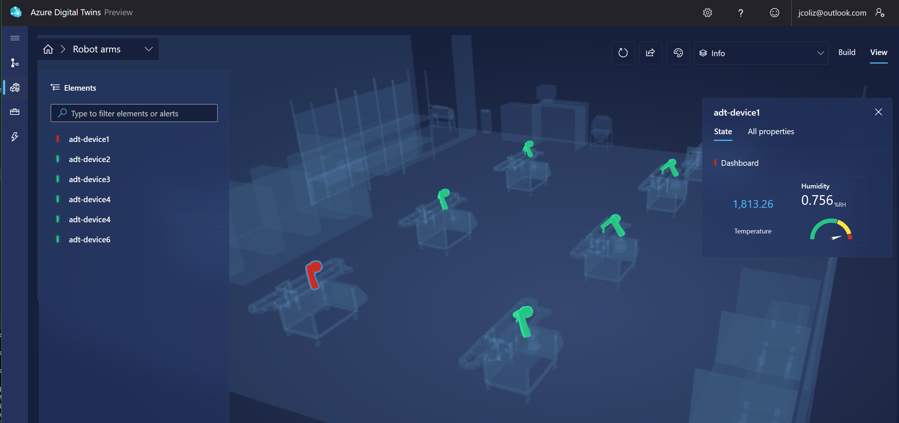
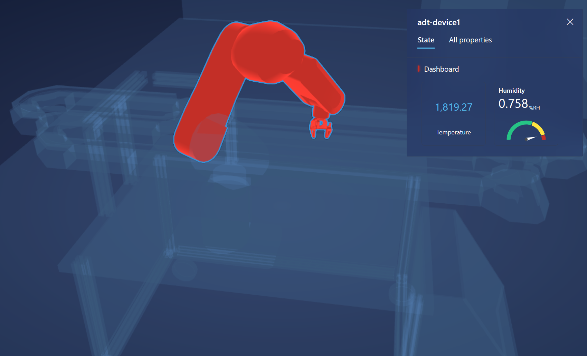
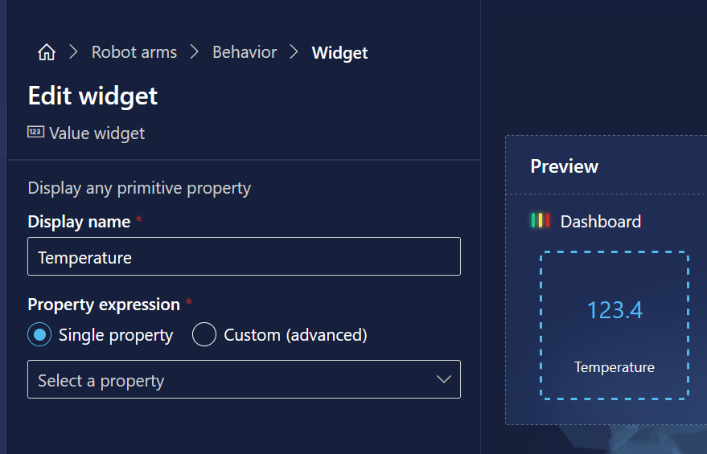
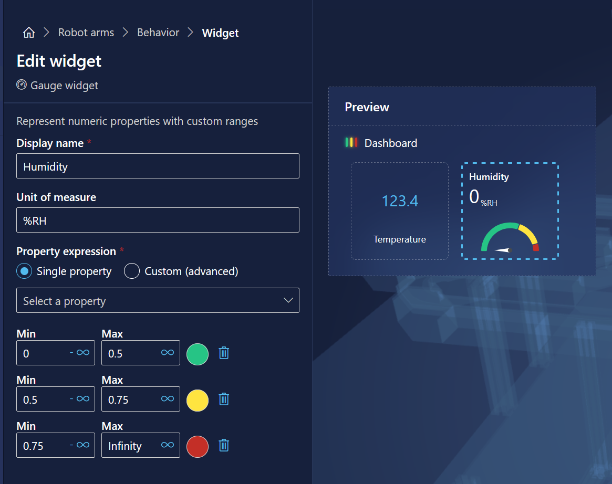
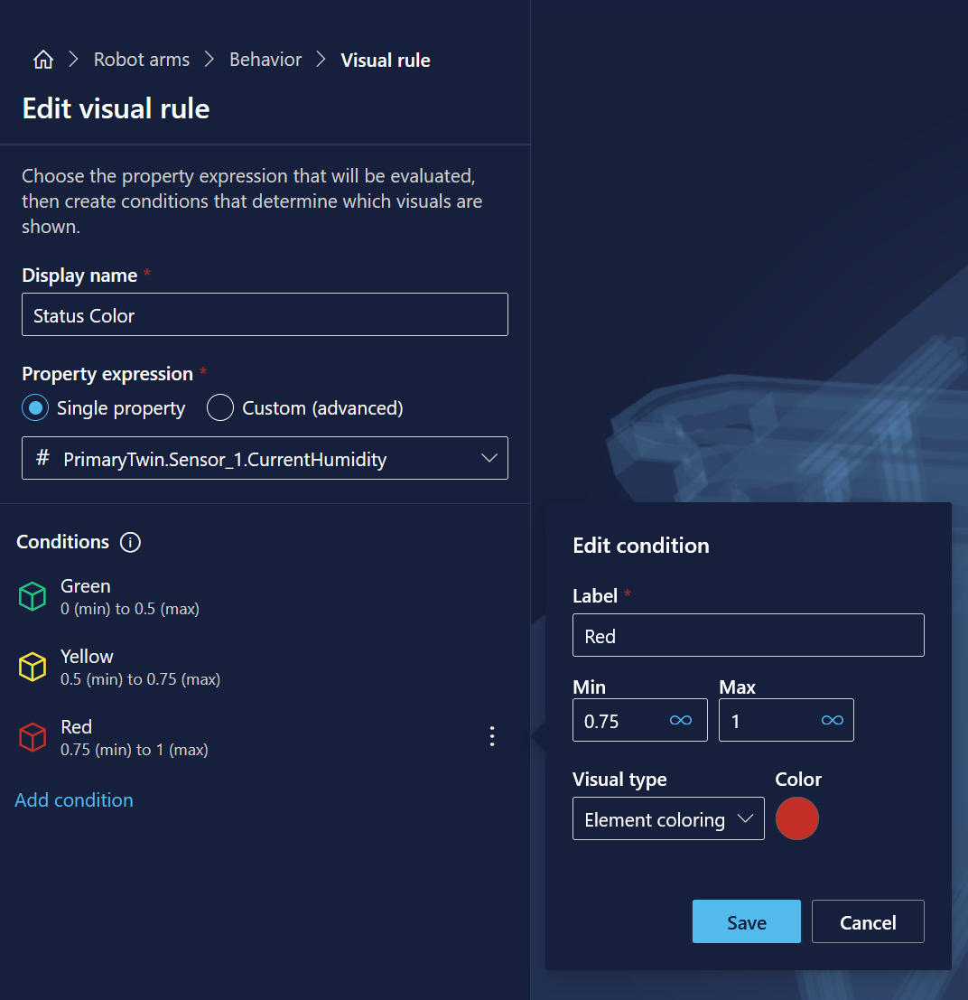

# Visualize an Azure Digital Twins instance in 3D

[3d Scenes Studio for Azure Digital Twins](https://learn.microsoft.com/en-us/azure/digital-twins/concepts-3d-scenes-studio)
is an incredibly powerful way to understand what's going on in your system quickly.
Using a 3D model of your environment, this tool connects this view with the real-life data flowing
into your Digital Twin instance. Compared to a query view table, or even a typical text-heavy dashboard, this is a much more intuitive way to understand the data coming into your system. It also lets you spot trouble areas at a glance, while giving you the tools needed to dig in further.

In this article, I wanted to give a step-by-step walkthrough of to harness the power of this incredible tool.

## Getting Started

First, let's build up an Digital Twins instance, with data flowing in from IoT Devices connected to an IoT Hub.
The [AzFn.IoTHubDigitalTwins](https://github.com/jcoliz/AzFn.IoTHubTrigger/tree/main/AzFn.IotHubDigitalTwins) project
will explain how to do this.

That example uses the [I2CTemperatureHumidityMonitor](https://github.com/jcoliz/AzDevice.IoTHubWorker/tree/main/examples/I2cTempHumidityMonitor) example client from the [AzDevice.IoTHubWorker](https://github.com/jcoliz/AzDevice.IoTHubWorker) project in order to send data up to IoT Hub.
It sends simulated data by default, so there's no need to build out the whole Raspberry Pi
physical setup. However, if you DO build that out, it will work great with this example as well.

## Set up 3D Scenes Studio

Launch [3D Scenes Studio](https://explorer.digitaltwins.azure.net/3dscenes/) to get started, then follow along as we get it working! At a high level, here's what we'll need to do to set up 3D Scenes Studio for our example

1. Import a 3D model
2. Associate a unique 3D model mesh to each individual twin
3. Choose what to display for each twin
4. Apply the Behavior to all elements

### Add the example model

The key feature of 3D Scenes Studio is to visualize your Digital Twins environment in 3D form. You can import a model in [glTF](https://github.com/KhronosGroup/glTF). Blender works great to create and export these models. For our purpose, we can use the Robot Arms file provided in the documentation. Download it here: [Robot Arms glTF](https://cardboardresources.blob.core.windows.net/public/RobotArms.glb).

1. Download the sample model locally
2. From the main page of the application, pick `Add new`.
3. Give the scene a name, e.g. "Robot Arms". Pick the sample model from your local machine, and pick `Create`.

### Create Elements for each robot arm

The first step in working with a model here is to associate a unique mesh to each individual twin in your system.

There are six robot arms in the model, so this example created six digital twins. For each one, you'll click on 
a mesh in one of the robot arms, pick `Create new element` from the presented menu, choose of of the six twins from
the list, and click `Create Element`. Now there is one visual display Element for each of the device twins in our
system. 

### Create a Behavior to display twin information 

The Behavior for each twin describes what we want to show. We will create one behavior, applied to each of our elements.

Here's what we want:

1. A dashboard for each element showing the important information
2. The current temperature displayed as a simple number on the dashboard 
3. The current humidity shown as a gauge with green/yellow/red gradations
4. A visual rule to set the overall element color based on the current humidity

First, we'll create the dashboard

1. Click the `Behaviors` tab atop the editing pane on the left
2. Click `New behavior`
3. Give it a name, e.g. "Dashboard"
4. Select all the elements from the `Elements` list. This will apply the behavior to all elements.

Now, add the temperature widget

1. Click `Widgets`, then `Add Widgets`
2. Pick a `Value` widget. 
3. Assign to it the PrimaryTwin.Sensor_1.Temperature property. 
4. Name it, and click Create Widget.

Next, the humidity widget

1. Again, click `Widgets`, then `Add Widgets`
2. This time, pick a `Gauge` widget. 
3. Choose the PrimaryTwin.Sensor_1.Humidity property. 
4. Add three ranges. Set the 0-0.5 range to Green color, 0.5-0.75 to Yellow, and 0.75 to infinity as Red. 
5. Name it, and click Create Widget.

Finally, the visual rules

1. Click `Visual rules`, then `Add rule`
2. Name it, e.g. "Status Color"
3. Choose the Sensor_1.Humidity property.
4. Add three conditions
5. Match the values and color to the humidity gauge: 0-0.5 range to Green, 0.5-0.75 to Yellow, and 0.75 to infinity as Red.

## Visualize your environment

Now that you have data flowing in, and your 3D scene is built, you can switch over to View mode to 
get an overall status view of your whole
system. 

In the picture below, we can quickly see that one machine is in a critical state, while the
other five are all OK. Clicking on the one machine brings up my dashboard, where I can see that
the humidity in this case is too high. The "All Properties" tab is available as well, if I want
to dig into the details.

## Dig deeper

The application comes with a Demo showing off the behaviors in great detail. It's available from the
main navigation bar on the left edge of the screen. Dig through it and learn more about what this
tool can do!